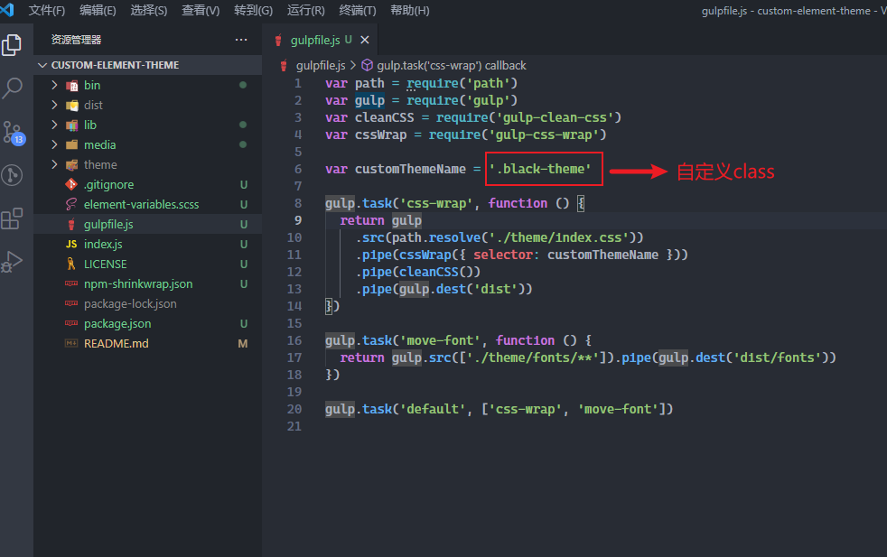

### 源地址: https://github.com/alysee0079/custom-element-theme
## Installation
```shell
npm i gulp-cli -g

npm i element-theme -g

npm install
```


## CLI
```shell
# init variables file
node_modules/.bin/et -i

# build theme
node_modules/.bin/et

# gulp css name wrapper
gulp

# 自定义前缀 class name
```


```
